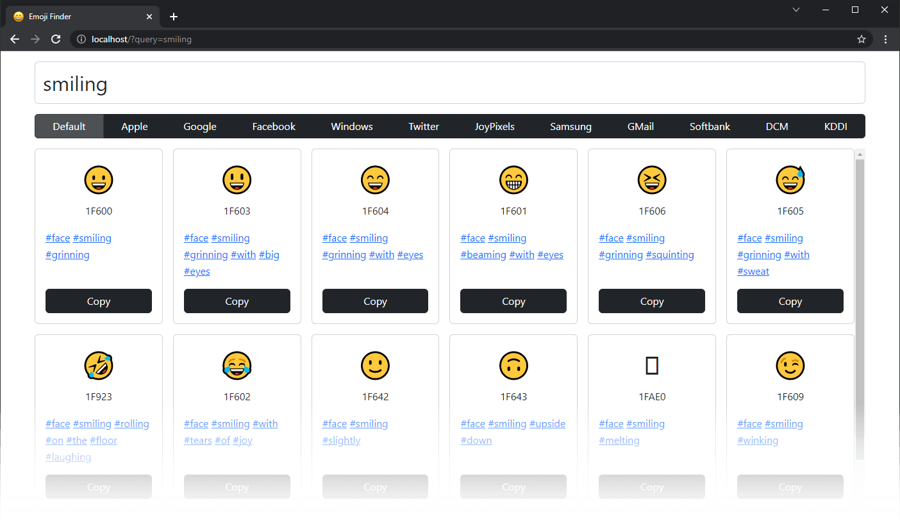

# Emoji Finder
Simple emoji finder app


## Building
```
npm install
npm run server
npm run build
```
Then open `localhost:80` in a browser.

## Directory structure
- `cli/` - Node.js scripts
- `src/` - TypeScript source code
	- `error/` - Error classes
	- `type/` - TypeScript types
		- `event/` - Event maps
	- `view/` - React components
	- `worker/` - Web workers
- `config.json` - The main app configuration file
- `index.html` - HTML entry point
- `index.scss` - SCSS entry point
- `index.ts` - TypeScript entry point

## config.json file
- `log` - Enables logging
- `pagination` - How many emoji items to show at once
	- `url` - Contains different URLs
		- `emoji` - A URL to Emoji JSON data file

## NPM scripts
- `clean` - Cleans the directory from compiled files
- `sass` - Compiles SASS styles
- `sass:watch` - Watches stylesheets and recompiles them when they change
- `webpack` - Compiles TypeScript
- `webpack:watch` - Watches TypeScript in devmode and recompiles them when they change
- `webpack:dev` - Compiles TypeScript in devmode
- `build` - Builds the entire project (runs all previous scripts)
- `build:dev` - Builds the entire project in devmode (runs all previous scripts)
- `make:emoji` - Generates emoji data
- `server` - Runs local server at `localhost:80`
- `test` - Runs tests
